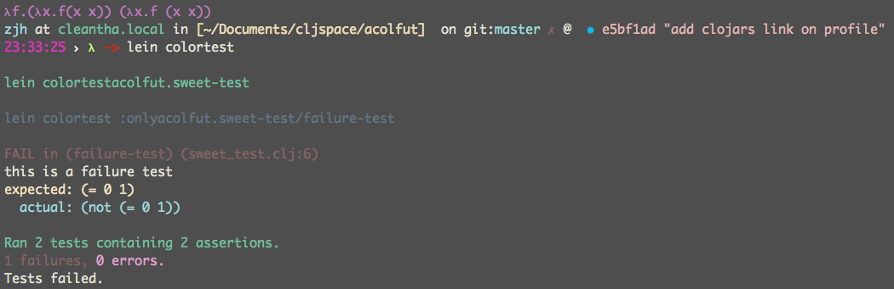

## Lein-Colortest

A Leiningen plugin to work with [acolfut](https://github.com/zjhmale/acolfut).

[](http://clojars.org/lein-colortest)

## Usage

* Use this for user-level plugins:

Put `[lein-colortest "0.3.0"]` in `~/.lein/profiles.clj`.

```clojure
{:user {:plugins [[lein-colortest "0.3.0"]]}}
```

* Use this for project-level plugins:

Put `[lein-colortest "0.3.0"]` into the `:plugins` vector of your `project.clj`.

* work with acolfut

Put `[acolfut "0.3.3"]` into the `:dependencies` vector of your `project.clj`.

* And just run the cmd to use it

```
$ lein colortest
```

## Warning

do not mix `clojure.test` in your namespace with `acolfut.sweet` this will confuse the defmulti dispatch for [report](https://github.com/clojure/clojure/blob/master/src/clj/clojure/test.clj#L332)

## Snapshot



## License

Copyright © 2015 jihui

Distributed under the Eclipse Public License, the same as Clojure.
